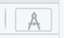
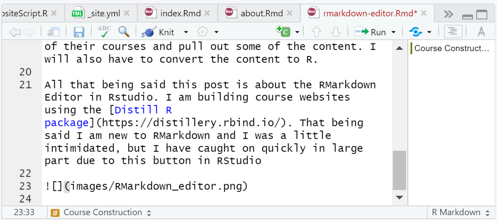
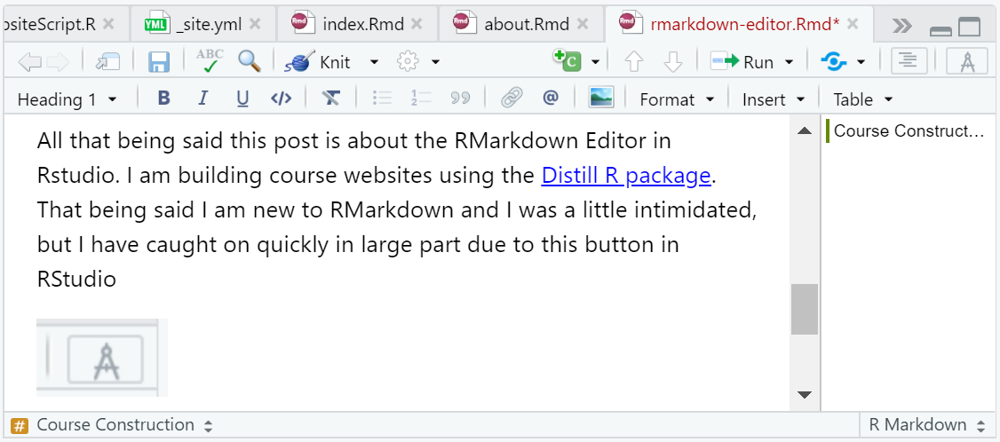

```{r setup, include=FALSE}
knitr::opts_chunk$set(echo = FALSE)
```

# Course Construction

For my courses I am using resources from the big 4 accounting firms. PWC has a [masters course](https://www.pwc.com/us/en/careers/university-relations/data-and-analytics-case-studies.html) laid out nicely that I am using for my undergraduate course. I am using the course content and adapting some of the exercises and tasks to fit into an undergraduate course. I am planning on using Deloitte's [data analytics course material](https://giesbusiness.illinois.edu/experience/academies-centers/the-university-of-illinois-deloitte-foundation-center-for-business-analytics/courses) for my masters level course. I will combine a couple of their courses and pull out some of the content. I will also have to convert the content to R.

All that being said this post is about the RMarkdown Editor in Rstudio. I am building course websites using the [Distill R package](https://distillery.rbind.io/). I am new to RMarkdown and I was a little intimidated, but I have caught on quickly in large part due to this button in RStudio

{width="40%"}

## Before you click



## After you click



## Button

The button gives you a "normal" text editor for RMarkdown. This makes creating anything from reports to websites VERY easy. If you need to code the document you switch back to RMarkdown default, but if you just want to type and insert pictures etc the text editor is AWESOME 🥳

