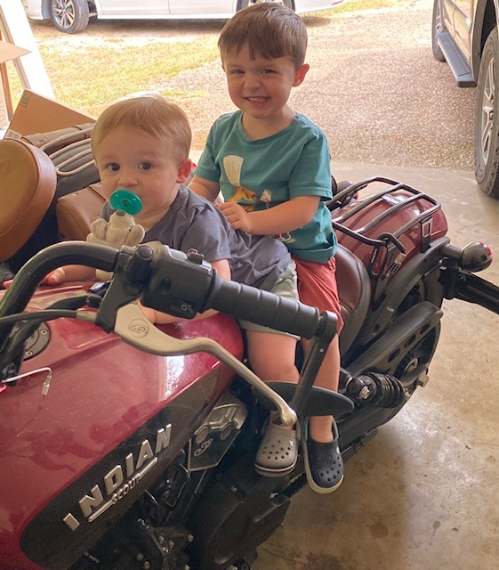

# General Info

I am an adjunct instructor at [Louisiana Tech University](https://business.latech.edu/undergraduate-programs/accounting/) in the accounting department. I teach a management accounting course, which is transitioning to include more data analytics. I am married with two boys (3 and 1.5) and I love it 😄 .

<details>

<summary>Click me to see 😍 My Boys 😍</summary>

<p>

```{r My_Boys, echo=FALSE, fig.cap="loads of fun", out.width = '80%'}

```

</p>

</details>

## Website Information

This is my personal website. I hope to update it and grow it into something special, but we will see... 😵
