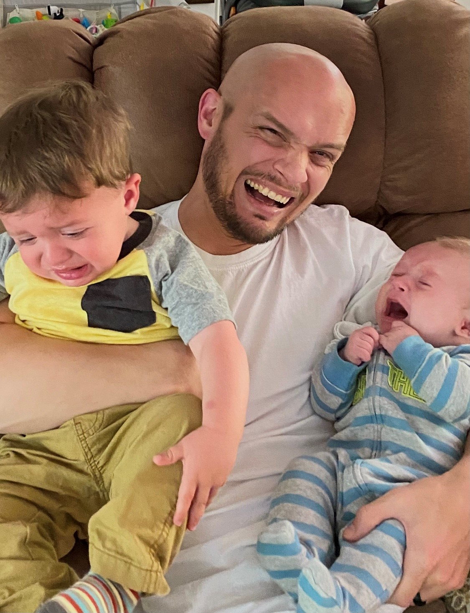

# General Info

I am an assistant professor at [Mississippi State University](https://www.business.msstate.edu/academics/adkerson-school-accountancy) in the accounting department. I teach an accounting systems 2, which is transitioning to an introduction to accounting data analytics, and I teach a masters level accounting data analytics course. I am married with two boys under 2.5 and I love it 😄 .

<details>

<summary>Click me to see 😍 My Boys 😍</summary>

<p>

```{r My_Boys, echo=FALSE, fig.cap="loads of fun", out.width = '80%'}

```

</p>

</details>

## Website Information

I hope to use this website as a professional/personal website. Professional in the capacity that plan to keep my cv and projects up to date. **😟**

Personal in the capacity that I am including emojis and pictures of my kids. So maybe lighthearted professional **😅**

# Still Under Construction
